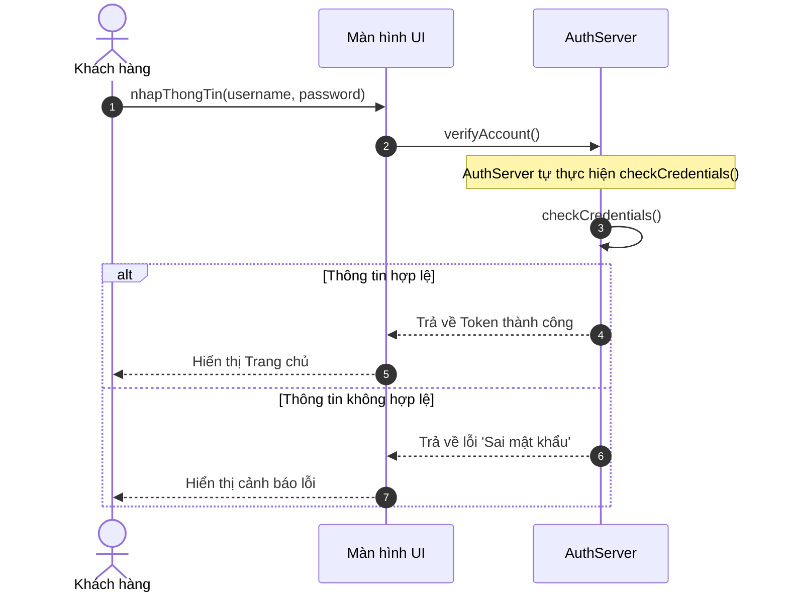

# BÁO CÁO PHÂN TÍCH VÀ THIẾT KẾ SEQUENCE DIAGRAM CHỨC NĂNG ĐĂNG NHẬP RIKKEISHOP

> 👤 **Học viên:** Đỗ Hoàng Sơn | **Mã SV:** PTIT-HCM-066
> 🏫 **Môn học:** IT105-K25-Phan-tich-thi-t-k-h-th-ng

---

## 📊 Sơ đồ thiết kế hệ thống (Sequence Diagram)

> 💡 *Sơ đồ dưới đây được render tự động trực tiếp trên GitHub bằng Mermaid. Bạn cũng có thể tải file **`bt1.drawio`** trong repository này để mở và chỉnh sửa trực tiếp trên [Draw.io (diagrams.net)](https://app.diagrams.net).* 

---

## Nhiệm vụ 1: Phân tích Kịch bản và Xác định Thành phần

Sau khi đọc kỹ kịch bản nghiệp vụ tính năng Đăng nhập của RikkeiShop, hệ thống bao gồm 3 thành phần chính tương ứng với các lifeline trong sơ đồ tuần tự:

1. Khách hàng (Actor): Người dùng tương tác trực tiếp với giao diện để nhập thông tin tài khoản và mật khẩu.

2. Màn hình UI (Object): Tầng giao diện tiếp nhận yêu cầu từ người dùng, gọi service xác thực và điều hướng màn hình dựa trên kết quả trả về.

3. AuthServer (Object): Tầng xử lý nghiệp vụ xác thực tập trung, tự kiểm tra thông tin nội bộ và trả kết quả về cho UI.

- Lifeline Actor nằm ở phía biên trái để khởi xướng các thông điệp.
- Lifeline UI đóng vai trò trung gian chuyển tiếp thông điệp giữa client và server.
- Lifeline AuthServer xử lý nghiệp vụ cốt lõi và tự gọi hàm kiểm tra nội bộ.

## Nhiệm vụ 2: Thiết lập Chuỗi Thông điệp Tuần tự và Khối Rẽ Nhánh

Luồng thông điệp được chuyển đổi từ mô tả bằng lời sang các loại mũi tên UML chuẩn xác, đảm bảo đúng bản chất kỹ thuật:

- Thông điệp đồng bộ (Sync): Khách hàng gọi 'nhapThongTin' tới UI, sau đó UI gọi tiếp 'verifyAccount' tới AuthServer (mũi tên nét liền đầu đặc).

- Thông điệp tự gọi (Self): AuthServer tự gọi phương thức nội bộ 'checkCredentials()' để kiểm tra thông tin mà không cần gọi thêm Database bên ngoài (mũi tên vòng cung quay lại chính Lifeline).

- Khối rẽ nhánh (alt): Được đặt ngay sau bước kiểm tra của AuthServer với hai guard condition là '[Thông tin hợp lệ]' và '[Thông tin không hợp lệ]' để phân tách rõ ràng hai kịch bản thành công và thất bại.

- Nhánh hợp lệ: AuthServer trả về Token (Return), UI điều hướng hiển thị Trang chủ cho khách hàng.
- Nhánh không hợp lệ: AuthServer trả về thông báo 'Sai mật khẩu' (Return), UI hiển thị cảnh báo lỗi trên màn hình.

## Nhiệm vụ 3: Bảng Đặc tả Chi tiết Luồng Thông Điệp Đăng Nhập

Dưới đây là bảng tổng hợp chi tiết các bước thông điệp trong Sequence Diagram để đội ngũ Developer dễ dàng hiện thực hóa mã nguồn:

| Bước | Loại thông điệp | Đối tượng gửi | Đối tượng nhận | Tên thông điệp / Hành động | Mô tả chi tiết |
| --- | --- | --- | --- | --- | --- |
| 1 | Sync | Khách hàng | Màn hình UI | nhapThongTin(username, password) | Khách hàng nhập thông tin và bấm nút đăng nhập |
| 2 | Sync | Màn hình UI | AuthServer | verifyAccount() | UI gửi yêu cầu xác thực sang AuthServer và chờ kết quả |
| 3 | Self | AuthServer | AuthServer | checkCredentials() | AuthServer tự xử lý nội bộ kiểm tra tính hợp lệ của tài khoản |
| 4a | Return | AuthServer | Màn hình UI | Trả về Token thành công | Trường hợp [Thông tin hợp lệ], cấp token xác thực |
| 5a | Return | Màn hình UI | Khách hàng | Hiển thị Trang chủ | UI điều hướng người dùng vào trang chủ thành công |
| 4b | Return | AuthServer | Màn hình UI | Trả về lỗi 'Sai mật khẩu' | Trường hợp [Thông tin không hợp lệ], gửi mã lỗi |
| 5b | Return | Màn hình UI | Khách hàng | Hiển thị cảnh báo lỗi | UI hiển thị popup thông báo lỗi đăng nhập cho khách hàng |

## Nhiệm vụ 4: Hướng dẫn Sử dụng và Kiểm tra File .drawio

Toàn bộ cấu trúc các đối tượng Lifeline, thông điệp Sync, Return, Self và khối Combined Fragment (alt) đã được thiết kế hoàn chỉnh.

Sinh viên đã tạo file mã nguồn Mermaid tương ứng để GitHub tự động render sơ đồ trực quan. File gốc 'rikkeishop_login_sequence.drawio' đã được chuẩn bị sẵn sàng để nộp lên repository của tổ chức 'IT105-K25-Phan-tich-thi-t-k-h-th-ng'.

---

## 📁 Danh sách tệp tin nộp bài trong Repository
- 📝 `bt1.docx`: Báo cáo tài liệu phân tích nghiệp vụ hoàn chỉnh.
- 🎨 `bt1.drawio`: File thiết kế sơ đồ chuẩn theo quy định đề bài (mở trực tiếp bằng [Draw.io](https://app.diagrams.net) hoặc Lucidchart).
